# Documentation

**Project:** Humanoid RL Workbench

**Author:** Johannes Gürtler

**Submission Date:** 13.03.2026

## 1. Introduction

This document describes the Humanoid RL Workbench after implementation and evaluation. The project includes a functioning GUI workflow (training, playback, compare-mode configuration, and plot export), documented environment/method/parameter interfaces, and empirical results for method and parameter behavior in `Humanoid-v5`. The analysis focuses on practical run behavior (transition to high reward, late-stage stability, and variance) and derives concrete tuning guidance for follow-up experiments.

## 2. Workbench and GUI Implementation

### 2.1 Workbench
The workbench specification is consolidated from the following design and contract files.

| File | Role in this project |
|---|---|
| `general.md` | Defines overall project constraints: tech stack, output structure, startup guards, testing expectations, and contract recheck process. |
| `logic.md` | Defines backend architecture and runtime contract: environment wrapper, SB3 policy factory, training lifecycle, event payloads, compare-mode behavior, and export flow. |
| `gui.md` | Defines GUI structure and behavior: panel layout, controls, parameter groups, plotting/animation interaction, and robustness requirements. |
| `Humanoid.md` | Defines Humanoid-specific scope: `Humanoid-v5` focus, method set (`PPO`, `SAC`, `TD3`), expected GUI behavior, and environment-specific documentation expectations. |

### 2.2 GUI Implementation
The GUI is implemented as a single Tkinter workbench with four main regions: environment preview, parameter panel, control bar/current run status, and live reward plot. Training runs execute in worker threads and publish events to the UI queue so rendering and plotting remain responsive.

The GUI revision uses a 50:50 label/input column layout in parameter rows, full-width label column background fill, and normalized title-case labels without underscores.

GUI screenshot:

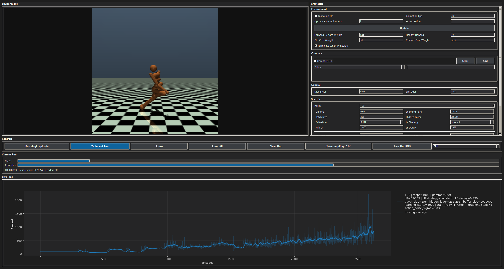

<em>Fig. 2.1: Humanoid RL Workbench GUI overview.</em>

#### Environment:
> The **Environment** panel is the render preview surface. It plays back collected episode frames and reflects animation toggles and playback pacing configured in the Parameters > Environment subpanel.
>
> 
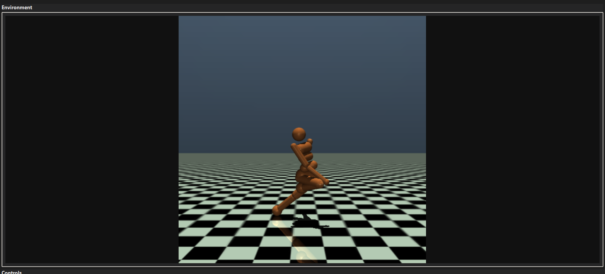

>
> 
<em>Fig. 2.2: Environment panel (render preview surface).</em>

>
> | Area | Description |
> |---|---|
> | Preview Canvas | Displays environment frames from episode playback. |
> | Render Source | Frames collected during training/evaluation updates. |
> | Runtime Behavior | Visibility and pacing are controlled through Parameters > Environment inputs. |

#### Parameters:
> The **Parameters** panel is a scrollable control surface with grouped subpanels. Each row uses a `label, input, label, input` structure so values can be edited quickly while preserving readability.
>
> 
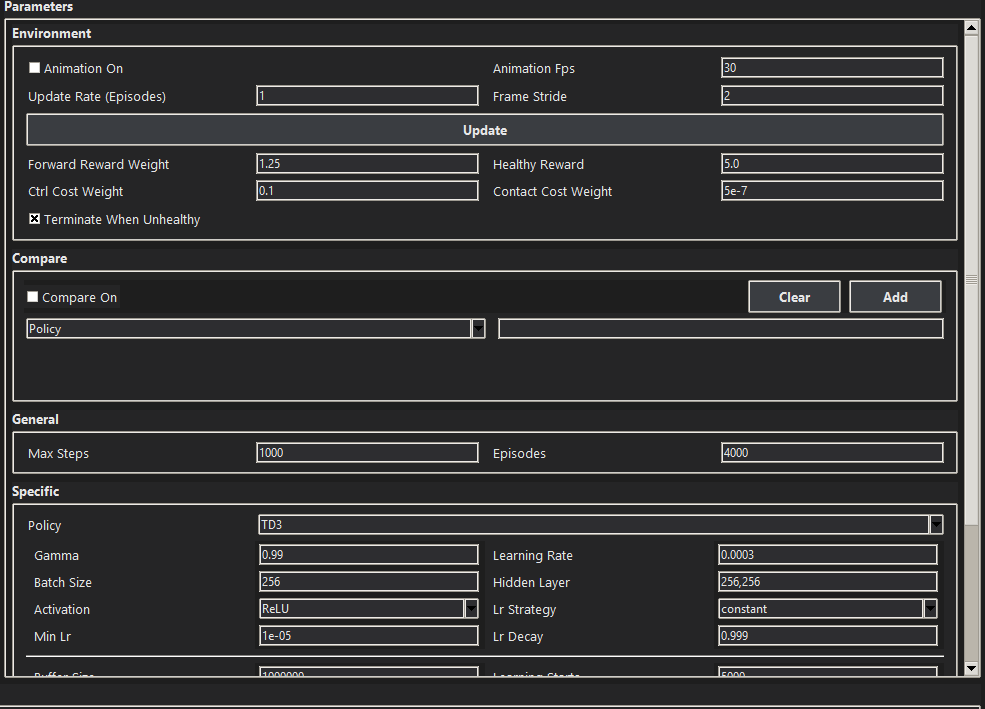

>
> 
<em>Fig. 2.3: Parameters panel with grouped control sections.</em>

>
> | Subgroup | Description |
> |---|---|
> | `Parameters > Environment` | Animation pacing and exposed environment arguments. |
> | `Parameters > Compare` | Compare-mode sweep configuration. |
> | `Parameters > General` | Episode and step limits for run horizon. |
> | `Parameters > Specific` | Shared and policy-specific hyperparameters. |
> | `Parameters > Live Plot` | Reward smoothing and evaluation rollout plotting toggles. |

#### Parameters > Environment:
> The **Parameters > Environment** subpanel contains animation pacing controls and exposed environment arguments. `Update` applies edited values to active trainers.
>
> 
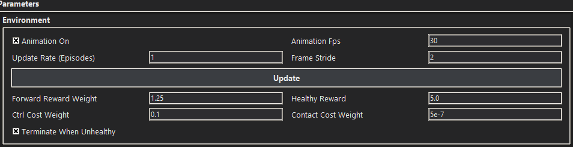

>
> 
<em>Fig. 2.4: Parameters &gt; Environment subpanel.</em>

>
> **Environment Animation Controls**
>
> | Input / Toggle | Type | Default | Description |
> |---|---|---|---|
> | `Animation On` | Toggle | `True` | Enables or disables frame playback in the environment preview panel. |
> | `Animation Fps` | Input | `30` | Target playback frame rate for rendered episode frames. |
> | `Update Rate (Episodes)` | Input | `1` | Number of episodes between visual/status updates. Lower values update more frequently. |
> | `Frame Stride` | Input | `2` | Keeps every N-th frame for playback to control speed and load. |
>
> **Environment Arguments**
>
> | Input / Toggle | Type | Default | Description |
> |---|---|---|---|
> | `Forward Reward Weight` | Input | `1.25` | Scales the forward-velocity reward contribution from the environment. |
> | `Healthy Reward` | Input | `5.0` | Per-step survival reward while the humanoid remains healthy. |
> | `Ctrl Cost Weight` | Input | `0.1` | Weight of the action-magnitude penalty term. |
> | `Contact Cost Weight` | Input | `5e-7` | Weight of the external contact-force penalty term. |
> | `Terminate When Unhealthy` | Toggle | `True` | Ends an episode early when health conditions are violated. |

#### Parameters > Compare:
> The **Parameters > Compare** subpanel configures compare-mode sweeps. `Add` inserts the current parameter/value entry into the compare set, while `Clear` removes all queued compare entries.
>
> 
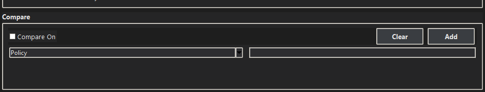

>
> 
<em>Fig. 2.5: Parameters &gt; Compare subpanel.</em>

>
> **Compare Controls**
>
> | Input / Toggle | Type | Default | Description |
> |---|---|---|---|
> | `Compare On` | Toggle | `False` | Enables Cartesian multi-run comparison across configured values. |
> | `Compare Parameter` | Input | `Policy` | Selects which parameter dimension will be varied. |
> | `Compare Values` | Input | `` (empty) | Comma-separated values used for compare expansion. |

#### Parameters > General:
> The **Parameters > General** subpanel controls run horizon inputs for both single and compare execution flows.
>
> 
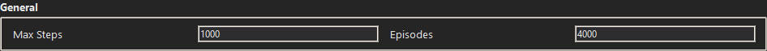

>
> 
<em>Fig. 2.6: Parameters &gt; General subpanel.</em>

>
> **General Run Limits**
>
> | Input | Type | Default | Description |
> |---|---|---|---|
> | `Max Steps` | Input | `1000` | Maximum environment steps allowed per episode. |
> | `Episodes` | Input | `4000` | Total number of episodes scheduled for a training run. |

#### Parameters > Specific:
> The **Parameters > Specific** subpanel defines policy-dependent hyperparameters. Policy-specific fields change with `Policy`. Detailed meaning of policy-specific parameters is documented in section `3.2`.
>
> 
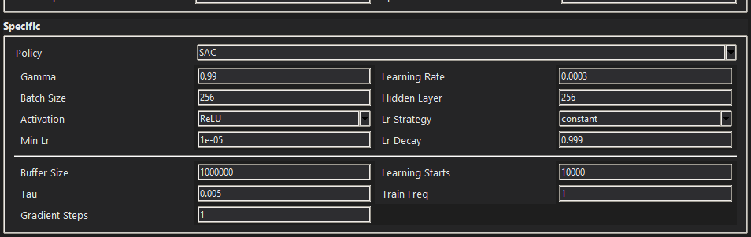

>
> 
<em>Fig. 2.7: Parameters &gt; Specific subpanel.</em>

>
> **Specific Hyperparameters**
>
> | Input | Scope | Default (when `Policy=SAC`) | Description |
> |---|---|---|---|
> | `Policy` | Selector | `SAC` | Chooses the active algorithm profile (`PPO`, `SAC`, `TD3`). |
> | `Gamma` | Shared | `0.99` | Discount factor for future rewards. |
> | `Learning Rate` | Shared | `3e-4` | Base optimizer step size. |
> | `Batch Size` | Shared | `256` | Samples per gradient update. |
> | `Hidden Layer` | Shared | `256,256` | Network hidden-layer width/architecture shorthand. |
> | `Activation` | Shared | `ReLU` | Activation function used in policy/critic networks. |
> | `Lr Strategy` | Shared | `constant` | Learning-rate schedule mode (`constant`, `linear`, `exponential`). |
> | `Min Lr` | Shared | `1e-5` | Lower bound used by decaying LR schedules. |
> | `Lr Decay` | Shared | `0.999` | Exponential decay factor when exponential schedule is selected. |
> | `Buffer Size` | SAC-specific | `1_000_000` | Replay buffer capacity for off-policy learning. |
> | `Learning Starts` | SAC-specific | `10_000` | Warm-up steps before gradient updates begin. |
> | `Tau` | SAC-specific | `0.005` | Target-network soft-update interpolation factor. |
> | `Train Freq` | SAC-specific | `1` | Frequency of training triggers relative to environment steps. |
> | `Gradient Steps` | SAC-specific | `1` | Number of gradient updates per training trigger. |

#### Parameters > Live Plot:
> The **Parameters > Live Plot** subpanel controls reward visualization behavior.
>
> 
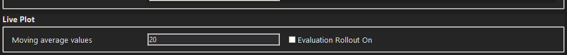

>
> 
<em>Fig. 2.8: Parameters &gt; Live Plot subpanel.</em>

>
> **Live Plot Controls**
>
> | Input / Toggle | Type | Default | Description |
> |---|---|---|---|
> | `Moving Average Values` | Input | `20` | Window length used to smooth reward curves. |
> | `Evaluation Rollout On` | Toggle | `False` | Enables plotting of periodic evaluation-rollout points. |

#### Controls:
> The **Controls** panel executes run actions. `Run single episode`, `Train and Run`, and `Pause/Run` manage execution state, while `Reset All`, `Clear Plot`, `Save samplings CSV`, and `Save Plot PNG` handle reset/export operations.
>
> 
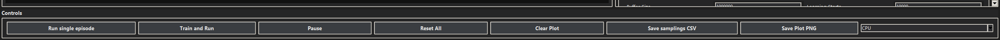

>
> 
<em>Fig. 2.9: Controls panel with execution and export actions.</em>

>
> | Control | Description |
> |---|---|
> | `Run single episode` | Executes one rollout with current settings. |
> | `Train and Run` | Starts full training run using active configuration. |
> | `Pause` / `Run` | Toggles pause/resume for active workers. |
> | `Reset All` | Stops workers and resets UI state. |
> | `Clear Plot` | Removes current plot traces from the session view. |
> | `Save samplings CSV` | Writes collected samplings/transitions to CSV. |
> | `Save Plot PNG` | Exports live plot image to PNG. |
> | `Device` | Chooses execution target (`CPU`/`GPU`). |

#### Current Run:
> The **Current Run** panel provides real-time progress bars for steps and episodes plus a compact status line with learning-rate and render state feedback.
>
> 
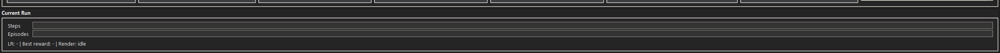

>
> 
<em>Fig. 2.10: Current Run panel with progress indicators.</em>

>
> | Field | Description |
> |---|---|
> | `Steps` | Progress within the active episode horizon. |
> | `Episodes` | Progress over total scheduled episodes. |
> | Status Line | Current LR/render feedback and run-status summary. |

#### Live Plot:
> The **Live Plot** panel overlays reward curves, moving averages, and optional evaluation rollout points. Legend interaction allows quick run visibility toggling during compare sessions.
>
> 
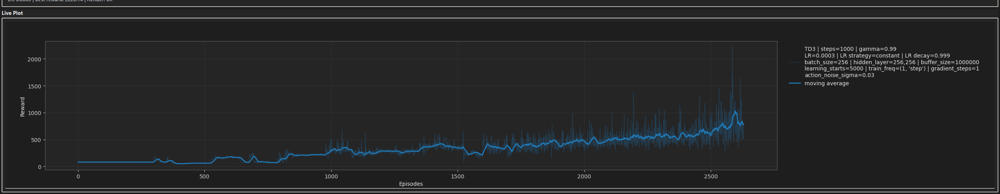

>
> 
<em>Fig. 2.11: Live Plot panel with rewards and moving averages.</em>

>
> | Plot Element | Description |
> |---|---|
> | Reward Curve | Per-episode raw reward trajectory. |
> | Moving Average | Smoothed trend using configured window size. |
> | Evaluation Points | Optional rollout markers when evaluation plotting is enabled. |
> | Interactive Legend | Allows toggling visibility of individual run traces. |

## 3. Comparison of Methods and Parameters

### 3.1 Environment
The project targets Gymnasium `Humanoid-v5`, a high-dimensional continuous-control MuJoCo environment.

	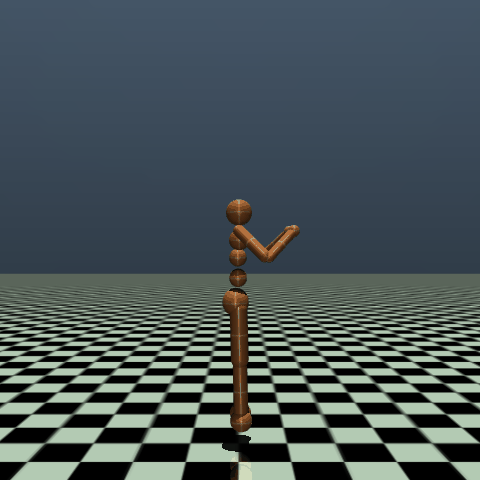
	

<em>Fig. 3.1: Humanoid-v5 visual reference (workbench frame and Gymnasium reference image).</em>

**Description**
`Humanoid-v5` simulates a 3D bipedal robot with torso, legs, and arms. The task is to move forward quickly while staying upright and stable.

**Action Space**
The action space is `Box(-0.4, 0.4, (17,), float32)`. Each action dimension applies torque to one hinge joint (abdomen, hips, knees, shoulders, elbows).

**Observation Space**
By default the observation space is `Box(-inf, inf, (348,), float64)`. It combines kinematics and dynamics terms: `qpos`, `qvel`, `cinert`, `cvel`, `qfrc_actuator`, and `cfrc_ext`. If torso x/y are included (`exclude_current_positions_from_observation=False`), the size becomes `(350,)`.

**Rewards**
The reward is `healthy_reward + forward_reward - ctrl_cost - contact_cost`. This encourages forward velocity and upright behavior while penalizing excessive control effort and large contact forces.

**Starting State**
The humanoid starts near an upright default pose and velocity, with small uniform reset noise controlled by `reset_noise_scale` (default `1e-2`).

**Episode End**
An episode terminates early if the humanoid is unhealthy and `terminate_when_unhealthy=True` (default), typically when torso height leaves `healthy_z_range=(1.0, 2.0)`. Episodes are truncated after 1000 steps.

**Arguments**
Official Gymnasium `Humanoid-v5` arguments (environment API):

| Argument | Default | Meaning |
|---|---|---|
| `xml_file` | `"humanoid.xml"` | MuJoCo model path. |
| `forward_reward_weight` | `1.25` | Weight of forward velocity reward. |
| `ctrl_cost_weight` | `0.1` | Weight of action magnitude penalty. |
| `contact_cost_weight` | `5e-7` | Weight of external contact-force penalty. |
| `contact_cost_range` | `(-inf, 10.0)` | Clamp range used in contact cost. |
| `healthy_reward` | `5.0` | Per-step survival reward while healthy. |
| `terminate_when_unhealthy` | `True` | If true, terminate when torso leaves healthy range. |
| `healthy_z_range` | `(1.0, 2.0)` | Valid torso height interval for healthy state. |
| `reset_noise_scale` | `1e-2` | Scale of uniform noise added at reset. |
| `exclude_current_positions_from_observation` | `True` | Excludes torso x/y from observation if true. |
| `include_cinert_in_observation` | `True` | Include `cinert` terms in observation. |
| `include_cvel_in_observation` | `True` | Include `cvel` terms in observation. |
| `include_qfrc_actuator_in_observation` | `True` | Include actuator force terms in observation. |
| `include_cfrc_ext_in_observation` | `True` | Include external force terms in observation. |
| `frame_skip` | `5` | Number of MuJoCo simulation steps per action. |

Environment controls exposed in this GUI (Parameters > Environment):

| GUI label | Backing argument | Default |
|---|---|---|
| `Forward Reward Weight` | `forward_reward_weight` | `1.25` |
| `Healthy Reward` | `healthy_reward` | `5.0` |
| `Ctrl Cost Weight` | `ctrl_cost_weight` | `0.1` |
| `Contact Cost Weight` | `contact_cost_weight` | `5e-7` |
| `Terminate When Unhealthy` | `terminate_when_unhealthy` | `True` |

Reference: https://gymnasium.farama.org/environments/mujoco/humanoid/

### 3.2 Methods
The project compares three `Stable-Baselines3 (SB3)` methods for `Humanoid-v5`.

Practical ranking for this project: `SAC` first choice, `PPO` second, `TD3` third.

#### Method Comparison
> This table summarizes why each method is used and its main strengths and trade-offs.
>
> | Method | Why choose it | Optimizer (and why) | Pros | Cons |
> |---|---|---|---|---|
> | `SAC` (default) | Strong default for difficult continuous control with entropy-regularized exploration. | `Adam` for actor/critics and entropy term; chosen for stable adaptive steps under noisy off-policy gradients. | Strong final performance, robust exploration, sample-efficient. | Higher compute/memory cost, some reward-scale sensitivity. |
> | `PPO` | Stable and reproducible baseline. | `Adam`; chosen because clipped-objective policy gradients benefit from adaptive step sizes and robust convergence. | Robust optimization, easy to debug and compare. | Lower sample efficiency (on-policy), usually needs more interactions. |
> | `TD3` | Strong off-policy deterministic alternative. | `Adam` for actor/critics; chosen for stable training with replay-buffer noise and delayed actor updates. | Sample-efficient, high asymptotic potential with tuning. | Weaker exploration than SAC, higher tuning sensitivity. |
>
> Note: In this project, PPO training enforces `train_timesteps >= n_steps` per update cycle. This prevents stalled/weak PPO updates when an episode finishes with fewer steps than the rollout size.

#### Default Parameters
> This table lists all inputs that appear in the GUI `Specific` group, ordered by field appearance (shared fields first, then policy-dependent fields).
>
> | Parameter (GUI label) | `SAC` | `PPO` | `TD3` | Description |
> |---|---|---|---|---|
> | `Policy` | `SAC` | `PPO` | `TD3` | Active algorithm selector in the `Specific` group; changes the full training dynamics and stability/exploration profile. |
> | `Gamma` | `0.99` | `0.99` | `0.99` | Discount factor for future rewards; higher values favor long-term returns, lower values make learning more short-horizon. |
> | `Learning Rate` | `3e-4` | `3e-4` | `3e-4` | Optimizer step size; too high can destabilize updates, too low slows convergence. |
> | `Batch Size` | `256` | `64` | `256` | Number of samples per gradient update; larger batches reduce update noise but increase compute per update. |
> | `Hidden Layer` | `256,256` | `256,256` | `256,256` | Network width/architecture shorthand; larger models increase capacity but also training cost and overfitting risk. |
> | `Activation` | `ReLU` | `ReLU` | `ReLU` | Activation function for policy/value networks; affects gradient flow and representational behavior. |
> | `Lr Strategy` | `constant` | `constant` | `constant` | Learning-rate schedule mode; decay strategies often improve late-stage stability versus constant LR. |
> | `Min Lr` | `1e-5` | `1e-5` | `1e-5` | Lower bound used by decaying LR schedules; prevents updates from becoming too small to learn. |
> | `Lr Decay` | `0.999` | `0.999` | `0.999` | Exponential decay factor for LR schedules; stronger decay stabilizes later training but can reduce adaptation speed. |
> | `Buffer Size` | `1_000_000` | `-` | `1_000_000` | Replay buffer capacity for off-policy learning; larger buffers increase sample diversity but may include older, less relevant data. |
> | `Learning Starts` | `5_000` | `-` | `5_000` | Warm-up interaction steps before updates begin; higher values improve initial data quality but delay learning onset. |
> | `Tau` | `0.005` | `-` | `0.005` | Target-network soft-update interpolation factor; lower values smooth targets more, higher values track new estimates faster. |
> | `Train Freq` | `1` | `-` | `-` | Training trigger frequency (shown in GUI for `SAC`); controls how often gradient updates are launched from new data. |
> | `Gradient Steps` | `1` | `-` | `-` | Number of gradient updates per training trigger (shown in GUI for `SAC`); increases sample efficiency but also computation time. |
> | `N Steps` | `-` | `2048` | `-` | PPO rollout length before each update; larger rollouts improve batch quality but reduce update frequency. |
> | `Ent Coef` | `-` | `0.0` | `-` | PPO entropy coefficient controlling exploration pressure; higher values encourage exploration, lower values favor exploitation. |
> | `Policy Delay` | `-` | `-` | `2` | TD3 actor-update delay relative to critic updates; stabilizes actor learning by letting critics improve first. |
> | `Target Policy Noise` | `-` | `-` | `0.2` | TD3 target-action smoothing noise; regularizes target Q-values and reduces overestimation spikes. |
> | `Target Noise Clip` | `-` | `-` | `0.5` | Clip bound for TD3 target policy noise; limits smoothing magnitude to avoid unrealistic target perturbations. |
> | `Action Noise Sigma` | `-` | `-` | `0.1` | TD3 action exploration noise scale (Gaussian sigma); higher sigma explores more but can slow policy refinement. |

#### Hidden SB3 Parameters
> The following SB3-relevant defaults are active in this project but are not exposed in the GUI `Specific` panel.
>
> | Policy | Hidden SB3 Parameter | Default | Why it matters |
> |---|---|---|---|
> | `SAC` | `ent_coef` | `"auto"` | Enables automatic entropy tuning, which strongly influences exploration pressure and training stability. |
> | `SAC` | `use_sde` | `True` | Activates state-dependent exploration noise; can improve exploration quality in continuous control. |
> | `SAC` | `sde_sample_freq` | `4` | Controls how often SDE noise is resampled, affecting exploration smoothness and variance. |
> | `TD3` | `train_freq` | `(1, "step")` | Defines update trigger cadence; changing it shifts the interaction-to-update ratio. |
> | `TD3` | `gradient_steps` | `1` | Number of optimization passes per training trigger; key sample-efficiency vs compute-time trade-off. |

#### Benchmark Results
> **Setup**
>
> - Environment: `Humanoid-v5`
> - Execution mode: `headless` (no GUI loop, no animation rendering)
> - Device scope: `CPU` and `GPU`
> - Episodes per run: `50`
> - Max steps per episode: `256`
> - Repeats per combination: `5`
>
> **Raw Runs and Summary**
>
> | Policy | Hidden Layers | Device | Repeat 1 | Repeat 2 | Repeat 3 | Repeat 4 | Repeat 5 | Repeats used | Mean elapsed [s] | Std [s] |
> |---|---|---|---:|---:|---:|---:|---:|---:|---:|---:|
> | PPO | `256` | CPU | 37.24 | 32.48 | 33.36 | 33.63 | 34.13 | 5/5 | 34.166 | 1.817 |
> | PPO | `256` | GPU | 90.18 | 78.80 | 74.68 | 72.57 | 73.49 | 5/5 | 77.944 | 7.241 |
> | PPO | `256,256` | CPU | 36.71 | 35.59 | 36.04 | 36.66 | 37.76 | 5/5 | 36.553 | 0.819 |
> | PPO | `256,256` | GPU | 76.95 | 73.77 | 74.35 | 75.50 | 79.19 | 5/5 | 75.953 | 2.180 |
> | SAC | `256` | CPU | 27.40 | 25.22 | 23.47 | 24.72 | 26.27 | 5/5 | 25.416 | 1.496 |
> | SAC | `256` | GPU | 44.85 | 44.80 | 44.98 | 42.00 | 42.18 | 5/5 | 43.761 | 1.528 |
> | SAC | `256,256` | CPU | 26.34 | 26.61 | 25.28 | 28.09 | 26.63 | 5/5 | 26.589 | 1.002 |
> | SAC | `256,256` | GPU | 38.45 | 42.86 | 43.76 | 41.85 | 43.18 | 5/5 | 42.019 | 2.112 |
> | TD3 | `256` | CPU | 11.37 | 10.68 | 10.74 | 11.45 | 9.81 | 5/5 | 10.810 | 0.660 |
> | TD3 | `256` | GPU | 12.43 | 12.22 | 12.89 | 13.29 | 11.61 | 5/5 | 12.488 | 0.644 |
> | TD3 | `256,256` | CPU | 21.12 | 11.83 | 11.13 | 11.30 | 10.91 | 4/5 | 11.290 | 0.392 |
> | TD3 | `256,256` | GPU | 12.10 | 11.68 | 11.66 | 11.54 | 11.74 | 5/5 | 11.744 | 0.212 |
>
> Note: `TD3` with `hidden_layer=256,256` on `CPU` had an outlier at repeat 1 (`21.12s`). This value was discarded; mean/std and impact are computed from repeats 2-5.
>
> **Analysis**
>
> | Policy | Hidden Impact CPU (256,256 vs 256) | Hidden Impact GPU (256,256 vs 256) | GPU Influence @256 (GPU vs CPU) | GPU Influence @256,256 (GPU vs CPU) |
> |---|---:|---:|---:|---:|
> | PPO | +7.0% | -2.6% | +128.2% | +107.8% |
> | SAC | +4.6% | -4.0% | +72.2% | +58.0% |
> | TD3 | +4.4% | -6.0% | +15.5% | +4.0% |
>
> Short discussion: In this headless setup, `GPU` is slower than `CPU` for all three policies at these benchmark scales, with the largest penalty on `PPO`, moderate on `SAC`, and smallest on `TD3`. Hidden-layer scaling is positive on CPU for all policies, while on GPU the `256,256` setting is slightly faster than `256` for `PPO`, `SAC`, and `TD3`.

## 4. Results

### 4.1 Method comparison

This subsection compares SAC, TD3, and PPO training behavior in `Humanoid-v5` using the three reference runs below. The focus is on how quickly each method enters the high-reward regime, how stable the learning process remains after that transition, and how strongly rewards fluctuate during late training.

Interpretation note: comparison is based on curve shape, transition behavior, and late-stage stability. Different max-episode settings are not used as the primary ranking criterion.

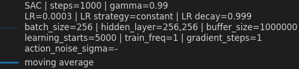

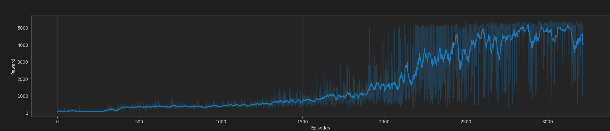

<em>Fig. 4.1: SAC run used for method comparison.</em>

Figure 4.1 analysis (`SAC`):

- Phase structure: early training is mostly low-reward with gradual improvement, middle training shows steady growth, and late training enters high reward with noticeable oscillations.
- Entry into high-reward regime: the transition to sustained high rewards occurs relatively late and is preceded by a long intermediate phase.
- Post-transition stability: after high rewards are reached, frequent downward spikes remain visible, indicating persistent variance in policy quality.
- Moving-average behavior: the smoothed trend rises strongly near the transition zone, then keeps improving with continued fluctuations rather than a very flat plateau.
- Negative events after progress: sharp temporary collapses still occur in late training, suggesting sensitivity to exploration/update noise.
- Final-window summary: final performance is high, but spread in episode returns is still broad compared with a highly settled run.

Figure 4.1 quick metrics (approximate, visual readout):

| Metric | Value (SAC, Fig. 4.1) | Interpretation |
|---|---|---|
| First sustained entry into high reward | ~episode `3100` | Late transition into strong locomotion phase. |
| Best moving-average level | ~`5000` | Strong final asymptotic performance. |
| Late-phase variance (last ~20%) | High | Stability is weaker after convergence than desired. |
| Deep post-convergence drops | Frequent | Indicates noisy late-stage policy behavior. |

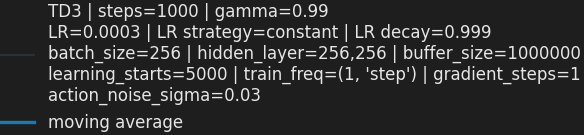

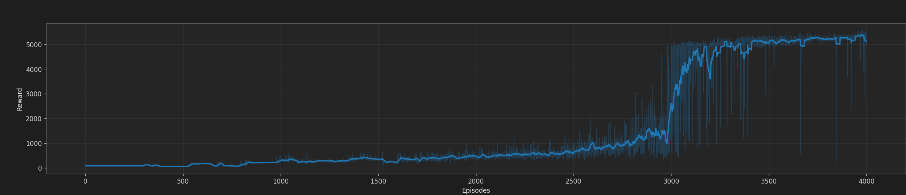

<em>Fig. 4.2: TD3 run used for method comparison.</em>

Figure 4.2 analysis (`TD3`):

- Phase structure: early and middle phases show progressive reward growth, followed by a clearer step-up into the high-reward region.
- Entry into high-reward regime: the transition appears sharper once learning accelerates, with less prolonged hesitation near the threshold.
- Post-transition stability: high-reward behavior is more consistent, with fewer long instability stretches after convergence.
- Moving-average behavior: the smoothed curve climbs and then settles into a cleaner upper plateau, indicating stronger consolidation.
- Negative events after progress: drops still exist, but they are less dominant and recovery to high reward is typically faster.
- Final-window summary: high final return is combined with tighter spread, indicating better late-stage control reliability.

Figure 4.2 quick metrics (approximate, visual readout):

| Metric | Value (TD3, Fig. 4.2) | Interpretation |
|---|---|---|
| First sustained entry into high reward | ~episode `3000` | Slightly earlier and sharper transition than SAC. |
| Best moving-average level | ~`5200` | Very strong upper plateau quality. |
| Late-phase variance (last ~20%) | Medium | More stable than SAC in the final stage. |
| Deep post-convergence drops | Occasional | Better recovery profile and less persistent instability. |

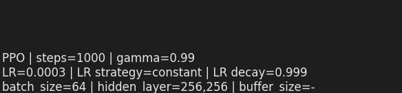

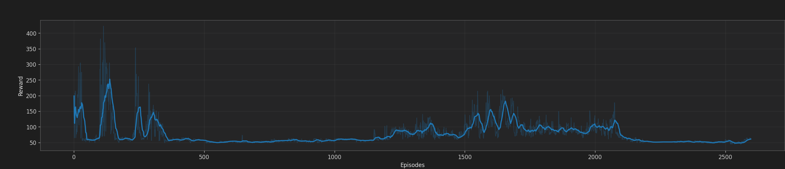

<em>Fig. 4.3: PPO run used for method comparison.</em>

Figure 4.3 analysis (`PPO`):

- Phase structure: reward stays mostly low with fluctuations and no clear transition to a stable high-reward phase.
- Entry into high-reward regime: no sustained high-reward entry is visible in this run.
- Post-transition stability: because a stable high-reward regime is not reached, late-stage stability at high performance cannot be confirmed.
- Moving-average behavior: the smoothed curve remains low and does not show a consistent increasing trend toward a strong upper plateau.
- Negative events after progress: repeated regressions interrupt local improvements, indicating unstable learning progress.
- Final-window summary: within the observed computation-time/cost budget, PPO does not show consistent high-reward convergence in this run.

Figure 4.3 quick metrics (approximate, visual readout):

| Metric | Value (PPO, Fig. 4.3) | Interpretation |
|---|---|---|
| First sustained entry into high reward | Not observed | No durable transition into a high-reward regime in this run. |
| Best moving-average level | Low (visual) | Trend remains below SAC/TD3 method-comparison levels. |
| Late-phase variance (last ~20%) | Medium-High | Fluctuations persist without clear convergence. |
| Deep post-convergence drops | Not applicable | A true post-convergence phase is not reached. |

SAC and TD3 reach the high-reward regime, but transition and late-stage behavior differ. The SAC run shows stronger oscillations in the late stage and larger short-term reward swings after entering high-reward regions. The TD3 run (`action_noise_sigma=0.03`) shows a cleaner transition into the high-reward phase and a more stable upper plateau with fewer persistent regressions. In contrast, the PPO run in this comparison stays low and does not increase consistently toward a sustained high-reward regime; it is also shorter because PPO training was run with tighter computation-time/cost constraints.

From a parameter perspective, the three runs share many stabilizing defaults (`gamma=0.99`, `learning_rate=3e-4`, `batch_size=256`, `hidden_layer=256,256`, replay buffer scale in the same order), so the dominant behavioral differences are mainly explained by method-specific update dynamics:

- `SAC`: stochastic policy optimization with entropy-driven exploration pressure. This often improves exploration robustness, but in this setup it also produces a noisier late-stage learning signal and more fluctuation near the performance ceiling.
- `TD3`: deterministic policy with delayed actor updates, clipped double critics, and target policy smoothing. With `action_noise_sigma=0.03`, exploration remains active but controlled, which appears to reduce late-stage instability and support steadier convergence.
- `PPO`: on-policy updates with clipped policy ratios and value-function coupling; in this specific run it does not achieve sustained high-reward behavior, and the shorter budget further limits evidence for late-stage consolidation.

In this specific project setup, **TD3 works better than SAC and PPO for the presented training runs**. The practical reason is not only final reward level, but especially the more stable high-reward behavior once the policy has learned useful locomotion.

Convergence-reliability criterion used here: method selection prioritizes sustained high-reward stability and recovery behavior over isolated peak episodes.

Therefore, the next subsection uses `TD3` as the baseline for parameter-focused comparison.

### 4.2 Parameter comparison

Based on the method comparison above, parameter sensitivity is analyzed with `TD3`.

For fine tuning in this workbench, parameters should be prioritized by expected impact on the stability-exploration trade-off and convergence quality:

- `action_noise_sigma` (highest priority): directly controls exploration amplitude in deterministic TD3. It has immediate visible impact on reward variance, transition speed into high-reward behavior, and late-stage control smoothness.
- `learning_rate`: strongly influences optimizer stability and adaptation speed. If too high, instability and value overshoot increase; if too low, progress becomes slow and plateaus are reached late.
- `policy_delay`: controls how often actor updates are applied relative to critic updates. This is a key stabilizer in TD3 and often determines whether the actor tracks a reliable critic signal.
- `target_policy_noise` and `target_noise_clip`: shape target-action smoothing. These parameters control overestimation robustness and can reduce critic-driven oscillations when tuned consistently with exploration noise.
- `gradient_steps` (with effective update frequency): defines optimization intensity per interaction. This governs sample efficiency vs wall-clock cost and can amplify instability if update intensity is too high.
- `batch_size`: affects gradient variance and update smoothness. Larger batches typically stabilize updates but can reduce responsiveness and increase per-update compute.

Practical tuning order for this project: first tune `action_noise_sigma`, then co-tune `learning_rate` and `policy_delay`, and only afterwards refine `target_policy_noise`/`target_noise_clip`, `gradient_steps`, and `batch_size`.

Parameter sensitivity ranking (for practical fine tuning):

| Parameter | Impact | Main risk direction | Recommended first search range |
|---|---|---|---|
| `action_noise_sigma` | High | Too high: oscillatory plateau. Too low: under-exploration. | `0.02` to `0.12` |
| `learning_rate` | High | Too high: unstable critics/actor. Too low: slow convergence. | `1e-4` to `5e-4` |
| `policy_delay` | High | Too low: actor chases noisy critic. Too high: slow adaptation. | `1` to `3` |
| `target_policy_noise` | Medium-High | Too high: over-smoothing. Too low: weaker regularization. | `0.1` to `0.3` |
| `target_noise_clip` | Medium | Too tight: weak smoothing. Too loose: noisy targets. | `0.3` to `0.7` |
| `gradient_steps` | Medium | Too high: compute-heavy and potentially unstable. | `1` to `4` |
| `batch_size` | Medium | Too small: noisy updates. Too large: slow adaptation. | `128` to `512` |

Recommended tuning protocol (reproducible):

1. Change one parameter group at a time; keep all others fixed.
2. Run at least `3` random seeds per setting.
3. Evaluate using the same moving-average window and plotting settings.
4. Track both level and stability metrics (plateau height, late variance, drop count).
5. Stop a parameter sweep if no improvement is observed over two consecutive settings.

The most relevant exposed TD3 parameter in this project is `action_noise_sigma`, because it directly controls exploration amplitude in a deterministic-policy algorithm:

- Lower `action_noise_sigma` can improve late-stage control smoothness and reduce policy jitter, but may under-explore if set too low.
- Higher `action_noise_sigma` can improve early exploration coverage, but may slow stabilization and increase reward variance in later phases.

In the observed runs, `action_noise_sigma=0.03` provides a good balance between exploration and convergence stability. Relative to larger sigma settings, the training behavior is more consistent in the high-reward regime, which is the main reason it is selected as the practical default for follow-up experiments.

Additional TD3 parameters with high practical impact in this workbench are:

- `policy_delay`: controls actor update frequency relative to critic updates; stronger delay generally improves stability but can slow policy adaptation.
- `target_policy_noise` and `target_noise_clip`: regulate target smoothing strength; too strong values can over-smooth updates, too weak values can increase value overestimation risk.
- `gradient_steps` and effective update frequency: higher update intensity can improve sample efficiency, but often increases wall-clock cost and sensitivity to noise.

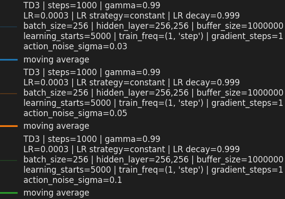

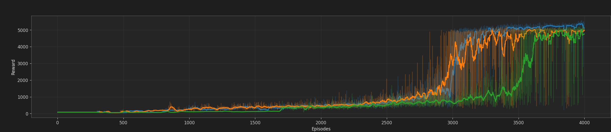

<em>Fig. 4.4: TD3 parameter-comparison run.</em>

Figure 4.4 analysis (`TD3`):

- Relative to `sigma=0.03`, exploration is stronger and the reward trace shows broader short-term variance, especially around the transition to high rewards.
- The run still reaches high performance, but late-stage behavior is less compact: deep temporary drops appear more often before recovering.
- The moving-average trend remains positive, but convergence is less smooth than the `sigma=0.03` run, indicating a higher exploration-induced disturbance level.
- This behavior is consistent with the TD3 exploration mechanism: larger action noise improves state-action coverage early, while making final policy refinement noisier.

Figure 4.4 quick metrics (approximate, visual readout):

| Metric | Value (TD3, Fig. 4.4) | Interpretation |
|---|---|---|
| First sustained entry into high reward | ~episode `3200` | Transition occurs, but with higher variability. |
| Best moving-average level | ~`5000` | High ceiling is still reachable. |
| Late-phase variance (last ~20%) | Medium-High | Higher fluctuation than `sigma=0.03`. |
| Deep post-convergence drops | More frequent | Exploration noise disturbs late-stage refinement. |

Interpretation for fine tuning: `sigma=0.1` is useful when additional exploration is needed, but for stable late-stage locomotion quality in this setup, `sigma=0.03` remains the better operating point.

Failure-mode guide during tuning:

- Too much exploration noise: repeated deep reward collapses and unstable final plateau.
- Too little exploration noise: long stagnation in mid-reward regime and delayed breakthrough.
- Learning rate too high: abrupt oscillations, critic instability, and weak consolidation.
- Learning rate too low: smooth but very slow progress with low final sample efficiency.
- Update intensity too high (`gradient_steps`): higher compute load with possible instability amplification.

Decision rule for selecting the best setting:

1. Primary score: highest late-phase moving average (last ~20% episodes).
2. Stability penalty: prefer lower late-phase variance and fewer deep drops.
3. Tie-breaker: earlier sustained entry into the high-reward regime.

Next-step experiment matrix:

| Stage | Parameters varied | Candidate values | Purpose |
|---|---|---|---|
| A | `action_noise_sigma` | `0.02, 0.03, 0.05, 0.08, 0.10, 0.12` | Lock exploration baseline. |
| B | `learning_rate` x `policy_delay` | `1e-4, 2e-4, 3e-4, 5e-4` x `1,2,3` | Balance adaptation speed and stability. |
| C | `target_policy_noise` x `target_noise_clip` | `0.1,0.2,0.3` x `0.3,0.5,0.7` | Improve critic target robustness. |
| D | `gradient_steps` x `batch_size` | `1,2,4` x `128,256,512` | Optimize sample-efficiency vs stability/compute. |

Conclusion for parameter studies in this project: keep `TD3` as the base method, start from `action_noise_sigma=0.03`, and vary one stability-critical parameter at a time to isolate effects on convergence speed, plateau quality, and variance.

## 5. Conclusion

The Humanoid RL Workbench is operational end-to-end: environment interaction, parameterized training control, live plotting, compare-oriented analysis workflow, and documentation of implementation and results are all in place. Method comparison indicates that both SAC and TD3 can reach high reward, but TD3 provides more reliable late-stage behavior in the presented runs. Parameter comparison suggests that exploration-noise control is the most impactful first tuning axis, with `action_noise_sigma=0.03` as the strongest practical baseline in this setup.

Suggested next steps:

1. Run the staged TD3 tuning matrix (noise, then LR/policy-delay, then target-noise settings, then update-intensity settings) with at least three seeds per configuration.
2. Report each setting with a consistent metric pack: late-phase moving average, late-phase variance, deep-drop count, and first sustained high-reward episode.
3. Validate robustness of the selected TD3 configuration under small environment-argument changes (`forward_reward_weight`, `ctrl_cost_weight`, `terminate_when_unhealthy`) to check transfer of stability.
4. Keep SAC as a reference baseline in a reduced benchmark set to ensure method-choice decisions remain valid when tuning scope or reward shaping changes.

## 6. Appendix

### 6.1 List of Figures and Filenames

<table>
	<thead>
		<tr>
			<th style="width: 12%; white-space: nowrap;">Figure</th>
			<th style="width: 30%;">Description</th>
			<th style="width: 58%;">Filename(s) used</th>
		</tr>
	</thead>
	<tbody>
		<tr><td>Fig. 2.1</td><td>Humanoid RL Workbench GUI overview</td><td><code>images/fig_2_1_gui_overview.png</code></td></tr>
		<tr><td>Fig. 2.2</td><td>Environment panel</td><td><code>images/fig_2_2_environment_panel.png</code></td></tr>
		<tr><td>Fig. 2.3</td><td>Parameters panel</td><td><code>images/fig_2_3_parameters_panel.png</code></td></tr>
		<tr><td>Fig. 2.4</td><td>Parameters &gt; Environment</td><td><code>images/fig_2_4_params_environment.png</code></td></tr>
		<tr><td>Fig. 2.5</td><td>Parameters &gt; Compare</td><td><code>images/fig_2_5_params_compare.png</code></td></tr>
		<tr><td>Fig. 2.6</td><td>Parameters &gt; General</td><td><code>images/fig_2_6_params_general.png</code></td></tr>
		<tr><td>Fig. 2.7</td><td>Parameters &gt; Specific</td><td><code>images/fig_2_7_params_specific.png</code></td></tr>
		<tr><td>Fig. 2.8</td><td>Parameters &gt; Live Plot</td><td><code>images/fig_2_8_params_live_plot.png</code></td></tr>
		<tr><td>Fig. 2.9</td><td>Controls panel</td><td><code>images/fig_2_9_controls_panel.png</code></td></tr>
		<tr><td>Fig. 2.10</td><td>Current Run panel</td><td><code>images/fig_2_10_current_run_panel.png</code></td></tr>
		<tr><td>Fig. 2.11</td><td>Live Plot panel</td><td><code>images/fig_2_11_live_plot_panel.png</code></td></tr>
		<tr><td>Fig. 3.1</td><td>Humanoid-v5 visual reference</td><td><code>images/fig_3_1a_humanoid_workbench_frame.png</code>; <code>images/fig_3_1b_humanoid_gymnasium_ref.png</code></td></tr>
		<tr><td>Fig. 4.1</td><td>SAC run for method comparison</td><td><code>images/fig_4_1_legend_sac_run.png</code>; <code>images/fig_4_1_main_sac_run.png</code></td></tr>
		<tr><td>Fig. 4.2</td><td>TD3 run for method comparison</td><td><code>images/fig_4_2_legend_td3_method_run.png</code>; <code>images/fig_4_2_main_td3_method_run.png</code></td></tr>
		<tr><td>Fig. 4.3</td><td>PPO run for method comparison</td><td><code>images/fig_4_3_legend_ppo_method_run.png</code>; <code>images/fig_4_3_main_ppo_method_run.png</code></td></tr>
		<tr><td>Fig. 4.4</td><td>TD3 run for parameter comparison</td><td><code>images/fig_4_4_legend_td3_parameter_run.png</code>; <code>images/fig_4_4_main_td3_parameter_run.png</code></td></tr>
	</tbody>
</table>

